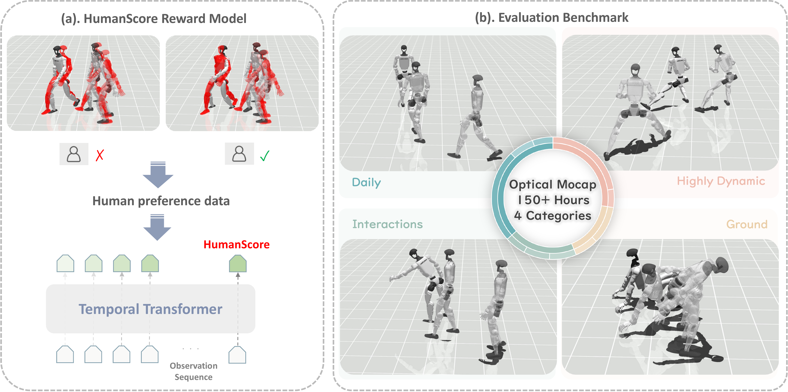

<div align="center">

# HumanTracker: Towards Comprehensive and Human-Aligned Motion Tracking Benchmark

<!-- **Towards Comprehensive and Human-Aligned Motion Tracking Benchmark** -->

Dairu Liu\* · Zekun Qi\* · Jiayu Zeng\* · Ruixi Yu · Yu Guan · Yintianrun Zhang · Xuchuan Chen
Sikai Liang · Zekai Li · Chenghuai Lin · Xinqiang Yu · Wenyao Zhang · He Wang† · Li Yi†

Nankai University · Tsinghua University · Galbot · Shanghai Jiao Tong University
Peking University · Shanghai Qi Zhi Institute

\*Equal contribution  †Corresponding author

**Accepted to ECCV 2026**

<p align="center">
  <a href="https://dairuliu.github.io/humantracker/"></a>
  <a href="https://arxiv.org/abs/2608.13555"></a>
  <a href="https://huggingface.co/datasets/GalaxyGeneralRobotics/HumanTracker"></a>
  <a href="https://github.com/GalaxyGeneralRobotics/HumanTracker"></a>
</p>



</div>

---

Humanoid motion tracking is central to teleoperation and whole-body imitation, yet
evaluation often disagrees with what people perceive in videos. Kinematic errors
average per-frame pose differences but miss the physical artifacts that matter most —
unstable support, and incorrect contacts such as foot skating and mistimed
touch-downs. Widely used test suites are also small, and lack the diversity needed to
stress contact-rich, long-horizon behaviors.

HumanTracker makes humanoid tracking evaluation both perceptually aligned and
scalable. It contributes **approximately 153 hours of newly captured optical motion**
from 24 professional performers, organized into four motion families with text labels
for fine-grained diagnosis. On top of it we propose **HumanScore**, a preference-aligned
metric trained from **12K human-labeled preference pairs** spanning **24K synchronized
tracker trajectories** via a trajectory reward model. Across representative
state-of-the-art trackers, HumanScore better predicts held-out human preferences and
reveals contact and stability failures that kinematic metrics often miss.

This repository holds the evaluation harness, the HumanScore reward model, and the
data tools used to build the preference dataset.

## The benchmark

Motions are grouped into four families by the failure regime they expose. All results
are reported per family as well as in aggregate; the distribution reflects the
frequency of the captured activities rather than forcing equal family sizes.

| Family | Hours | Clips | Typical challenges |
| --- | --- | --- | --- |
| Daily | 89 | 9.7k | steady locomotion, mild contacts |
| Highly Dynamic | 11 | 2.7k | impacts, aerial phases, fast footwork |
| Interaction | 48 | 10.9k | human-like, stable, smooth hands-body coordination |
| Ground | 5 | 1.6k | low posture, multi-contact transitions |
| **Total** | **153** | **25K** | |

Each clip carries a motion-family label, a natural-language description, a fitted SMPL
sequence, and a robot-space reference trajectory in `qpos` format. Human motion is
retargeted to the benchmark humanoid with
[GMR](https://arxiv.org/abs/2510.02252); retargeted sequences are inspected and
segments with capture artifacts (unexplained floating, ground penetration,
discontinuous contacts) are removed. The dataset is split 9:1 into disjoint train and
test partitions with the family distribution preserved.

### Zero-shot results

Succ (%) ↑, MPJPE (rad) ↓, HumanScore ↑ on a 0–100 scale, computed on the test split.
Numbers match Table 2 of the paper.

| | Daily | | | Highly Dynamic | | | Interaction | | | Ground | | |
| --- | --- | --- | --- | --- | --- | --- | --- | --- | --- | --- | --- | --- |
| **Method** | Succ | MPJPE | HScore | Succ | MPJPE | HScore | Succ | MPJPE | HScore | Succ | MPJPE | HScore |
| GMT | 17.0 | 0.250 | 2.4 | 36.2 | 0.196 | 7.0 | 81.4 | 0.205 | 11.7 | 0.0 | 0.456 | 4.0 |
| TWIST2 | 60.1 | 0.105 | 10.1 | 39.9 | 0.112 | 16.9 | 91.3 | 0.111 | 28.3 | 0.0 | 0.341 | 4.5 |
| SONIC | 93.8 | 0.102 | 49.5 | 82.1 | 0.118 | 41.0 | **97.6** | 0.128 | 54.6 | 20.1 | 0.231 | **26.5** |
| Humanoid-GPT | **94.4** | **0.046** | **54.7** | **86.9** | **0.047** | **49.2** | 97.2 | **0.070** | **56.8** | **32.9** | **0.216** | 24.9 |

Every tracker keeps its native observation and action-processing stack, receives the
same retargeted references, and is measured by the same evaluator under the SONIC
termination criterion.

## Installation

Prerequisites: an NVIDIA GPU with CUDA 12.x, and Conda or Miniconda.

```bash
conda create -n humantracker python=3.12 -y
conda activate humantracker
pip install -e .
```

Optional extras:

```bash
pip install -e ".[annotation]"   # web annotation interface and video export
```

Copy `.env.example` to `.env` for experiment-tracking credentials. `.env` is
gitignored and must never be committed.

### Upstream trackers

The four evaluated trackers are not part of this repository.

```bash
./setup_thirdparty.sh
```

This clones each tracker under `thirdparty/` at the pinned commit and applies the
patches in `thirdparty/patches/`. GR00T-WholeBodyControl distributes its meshes
through `git-lfs`, so install that first.

| upstream | `--tracker` | pinned | policy weights |
| --- | --- | --- | --- |
| [GR00T-WholeBodyControl](https://github.com/NVlabs/GR00T-WholeBodyControl) | `sonic` | `c3562ef` | Hugging Face (below) |
| [Humanoid-GPT](https://github.com/GalaxyGeneralRobotics/Humanoid-GPT) | `hgpt` | `457a040` | supplied separately (below) |
| [TWIST2](https://github.com/amazon-far/TWIST2) | `twist2` | `d5c7108` | ships with the checkout |
| [humanoid-general-motion-tracking](https://github.com/zixuan417/humanoid-general-motion-tracking) | `gmt` | `2a590de` | ships with the checkout |

SONIC publishes its ONNX policy on Hugging Face rather than in the repository:

```bash
cd thirdparty/GR00T-WholeBodyControl && python download_from_hf.py
```

The Humanoid-GPT policy evaluated here (`pns_wo_priv216.onnx`) is not part of the
upstream repository. Place it at
`thirdparty/Humanoid-GPT/storage/ckpts/pns_wo_priv216.onnx`, or point `--policy` at
your own checkpoint.

## Evaluating a tracker

Every tracker is converted to the same 29-DoF humanoid `qpos` representation and run
through one common MuJoCo evaluation entry point. Each backend keeps its native policy
observations and action decoder; the evaluator standardizes the motion list, robot
model, reference indexing, rollout accounting and metric implementation, and records
the same state history — generalized position/velocity, action, motor target, foot
contacts and forces, foot/pelvis velocities and 14 keypoint poses — for every tracker,
so differences in post-processing are never mistaken for differences between trackers.

```bash
python -m humantracker.eval.eval_parallel_tracker \
    --tracker sonic \
    --mocap_path /path/to/HumanTracker \
    --test_json /path/to/HumanTracker/test.json \
    --termination_metric whole_body
```

HumanScore is read from `storage/checkpoints/reward_model/best.pt`, where the released
weights unpack; `--rm_checkpoint` selects another one.

`--tracker` accepts `sonic`, `twist2`, `gmt` and `hgpt`, one backend module each under
[backends/](src/humantracker/eval/backends). A backend declares the flags only it
needs — `--policy` for `twist2`, `gmt` and `hgpt`, `--encoder`/`--decoder` for
`sonic` — so `--help` shows the selected tracker's options and no others.
`--termination_metric whole_body` applies SONIC's published termination terms
uniformly to every tracker, which is what the paper reports; `trunk` uses the same
thresholds but watches the pelvis and torso only. The flag is required — there is
no default, so a results file always states which rule produced it.

Within one tracker, `--workers` (default 8) evaluates trajectories in parallel worker
processes on a single GPU. To evaluate multiple trackers at once, run one process per
GPU with `CUDA_VISIBLE_DEVICES`:

```bash
CUDA_VISIBLE_DEVICES=0 python -m humantracker.eval.eval_parallel_tracker --tracker sonic  ... &
CUDA_VISIBLE_DEVICES=1 python -m humantracker.eval.eval_parallel_tracker --tracker twist2 ... &
CUDA_VISIBLE_DEVICES=2 python -m humantracker.eval.eval_parallel_tracker --tracker gmt    ... &
```

[`eval.sh`](src/humantracker/eval/eval.sh) automates this for all four trackers on
GPUs 0–3:

```bash
export HUMANTRACKER_DATASET=/path/to/HumanTracker
bash src/humantracker/eval/eval.sh
```

### Metrics

Reported per motion family and in aggregate, on the test split only:

- **Succ** — fraction of episodes that run to completion. An episode fails once the
  vertical position error at the pelvis, either ankle or either wrist exceeds 0.25 m,
  the pelvis rotation error exceeds 1 rad, or `qpos`/`qvel` goes non-finite.
- **MPJPE** — mean absolute error over the 29 actuated joint angles (radians), over the
  executed portion of the rollout.
- **HumanScore** — the preference-aligned score below, on a 0–100 scale.

Additional diagnostics (joint-velocity error, keypoint-position error, foot-contact
agreement, joint acceleration/jerk) are computed from the same recorded state and used
in the paper's preference-alignment study rather than the headline table.

### HumanScore at evaluation time

A rollout of `F` frames is split into consecutive 250-frame (5 s at 50 Hz) windows,
with a shorter final window padded on the right and scored through the same validity
mask used in training. Each window's unbounded reward is mapped through a sigmoid to
`(0, 1)`, and HumanScore is 100× the frame-count-weighted mean of the window scores —
padding contributes no weight. This windowed, mask-aware scoring is implemented once in
[`rm_scorer.py`](src/humantracker/eval/core/rm_scorer.py) and shared by every backend.

### Reproducibility

`--device cpu` is bit-reproducible: two runs of the same command return identical metrics.
`--device cuda` is not. Repeating one single-trajectory run gave three distinct outcomes in
four runs — the kinematic metrics moved in the third significant figure (`joint_pos_mae`
0.0786 to 0.0803), and HumanScore, which reads the whole sequence at once, moved from -0.35
to -0.53. The closed loop runs on the order of 1600 control steps, so a last-bit difference
in one policy forward pass has room to grow, and no seed or determinism flag is set anywhere
in the eval. Report GPU results as means over the full test set, as the paper does, and use
`--device cpu` when you need a figure to land on the same bits twice.

## Training HumanScore

HumanScore is a Transformer reward model trained on pairwise human preferences over
synchronized tracker rollouts.

**Input.** Each frame is a 539-dimensional token: 70 dimensions describing the current
reference (root pose/velocity, joint position/velocity, foot contact) and 469
dimensions describing the simulated rollout (robot state and action, measured contact
dynamics, root motion and current keypoint kinematics). The reported model does not
use future-reference residuals — conditioning only on the current reference and
rollout history is enough to assess tracking quality, and is what
[`trainer.py`](src/humantracker/reward_model/train/trainer.py) trains by default. The
full per-block breakdown is in the paper's appendix.

**Architecture.** The 539-d token is linearly projected, normalized, and given
sinusoidal positional encoding, then passed through a Transformer encoder with a
padding mask applied at every attention layer. Segments shorter than 250 frames (5 s at
50 Hz) are right-zero-padded; the same validity mask excludes padding from both
attention and the masked-mean pooling that forms the trajectory representation, so full
and truncated windows share one model without padding artifacts. An MLP head maps the
pooled representation to a scalar, unbounded reward
([`reward_model.py`](src/humantracker/reward_model/models/reward_model.py)).

**Objective.** For a strict preference pair, the model scores the chosen and rejected
trajectory and trains their score gap with a Bradley–Terry loss. Rarer `Similar` pairs
(annotators found neither trajectory clearly better) instead get a symmetric loss that
targets a 0.5 win probability. Both are implemented as one soft-target Bradley–Terry
objective in
[`SoftTargetBradleyTerryLoss`](src/humantracker/reward_model/models/loss.py).

```bash
python -m humantracker.reward_model.train.trainer \
    --data_dir /path/to/preference_pairs \
    --cache_dir /path/to/feature_cache \
    --output_dir storage/checkpoints/reward_model
```

Each run writes `<output_dir>/<run_name>/{best,last}.pt`; promote the run you want to
serve to `storage/checkpoints/reward_model/best.pt`, the path
[`eval.sh`](src/humantracker/eval/eval.sh) and the eval entry point read by default.
[`train.sh`](src/humantracker/reward_model/train/train.sh) in the same directory wraps
the command above with the paper's reported hyperparameters (`d_model=256`, 4 layers,
8 heads, batch size 8, AdamW at `1e-4` with cosine warmup, 20 epochs, `float32`) and
reads `DATA_DIR` from the environment. Evaluate a trained checkpoint against the
held-out, motion-disjoint test cohort with
[`evaluate_checkpoint.py`](src/humantracker/reward_model/train/evaluate_checkpoint.py):

```bash
python -m humantracker.reward_model.train.evaluate_checkpoint \
    --checkpoint storage/checkpoints/reward_model/best.pt \
    --cache_dir /path/to/feature_cache \
    --output preference_accuracy.json
```

## Building preference data

The preference pool is generated exclusively from the training split: for each source
motion, GMT, TWIST2, SONIC and Humanoid-GPT produce aligned rollouts of the same
robot-space reference, each divided into consecutive 5 s (250-frame) windows. A
uniformly spaced sample across the full ordered catalogue selects 6,000 windows, with
the six unordered tracker pairs allocated equally so every tracker appears equally
often and no pairing dominates. Six doctoral researchers in humanoid robotics compared
each pair for balance, contact, stability and naturalness, choosing a strict
preference, `Similar`, or `Cannot compare` (excluded from training). Records are split
80/20 by source `motion_id`, so all clips from one motion stay in one partition.

`tool/` holds the two utilities the released pipeline depends on:

| Directory | Responsibility | Entry point |
| --- | --- | --- |
| [rm_pipeline/](tool/rm_pipeline) | Rollout clipping, preference-pair construction, validation, aggregation, reward-model export | `python -m tool.rm_pipeline --help` |
| [motion_annotation/](tool/motion_annotation) | Pairwise motion rendering and the human annotation interface | `bash tool/motion_annotation/run_prerender_all.sh` |

Runtime readers accept only the canonical schema. Records that do not match
fail validation; nothing is silently coerced or padded.

## Repository layout

```
src/humantracker/
  eval/              tracker evaluation harness
    backends/        per-tracker simulation loops (internal modules)
    core/            shared metrics, HumanScore features, rollout export
  reward_model/      HumanScore model, datasets and training
  data/              motion-disjoint train/test splitting
tool/
  rm_pipeline/       preference-pair construction
  motion_annotation/ rendering and human annotation
thirdparty/          upstream tracker checkouts (cloned by setup_thirdparty.sh),
                     plus our patches/ against them
storage/             datasets, checkpoints and generated artifacts (not tracked)
```

## Configuration

Paths are resolved relative to the repository root, and every machine-specific value
comes from a flag or an environment variable. Scripts fail immediately with a message
naming the variable rather than guessing a default.

| Variable | Used by | Meaning |
| --- | --- | --- |
| `HUMANTRACKER_DATASET` | `eval.sh` | motion dataset root |
| `HUMANTRACKER_RM_CHECKPOINT` | `eval.sh` | HumanScore checkpoint (default: `storage/checkpoints/reward_model/best.pt`) |
| `G1_VERSION` | `hgpt` backend | G1 revision the released checkpoints assume; must be `5010` |
| `HUMANTRACKER_ROLLOUT_RUN_ID` | rollout export | run id used in exported filenames (or `--rollout_run_id`) |
| `DATA_DIR` | `train.sh` | annotated preference-pair directory |
| `TASK_FILE` | `run_prerender_all.sh` | `pairs.jsonl` produced by `rm_pipeline` |
| `HF_LOGS_DIR` | `run_prerender_all.sh` | directory annotations are written to |
| `PYTHON` | all shell scripts | interpreter to use (defaults to `python`) |

Evaluation renders headlessly: `MUJOCO_GL`, `PYOPENGL_PLATFORM` and
`__EGL_VENDOR_LIBRARY_DIRS` are set to EGL and to the ICD file in
[egl_conf/](egl_conf) before MuJoCo is imported. Exporting any of them beforehand takes
precedence, which is how a machine with a different driver is accommodated.

## Citation

```bibtex
@misc{liu2026humantrackercomprehensivehumanalignedmotion,
      title={HumanTracker: Towards Comprehensive and Human-Aligned Motion Tracking Benchmark}, 
      author={Dairu Liu and Zekun Qi and Jiayu Zeng and Ruixi Yu and Yu Guan and Yintianrun Zhang and Xuchuan Chen and Sikai Liang and Zekai Li and Chenghuai Lin and Xinqiang Yu and Wenyao Zhang and He Wang and Li Yi},
      year={2026},
      eprint={2608.13555},
      archivePrefix={arXiv},
      primaryClass={cs.RO},
      url={https://arxiv.org/abs/2608.13555}, 
}
```

## License

Released under the [Apache License 2.0](LICENSE). The upstream trackers under
`thirdparty/` and the tracker policies remain under their own licenses. The G1
description in [storage/assets/unitree_g1_5010/](storage/assets/unitree_g1_5010) is
redistributed under Unitree Robotics' BSD 3-Clause license, included alongside it.

## Acknowledgements

We build on [GMR](https://arxiv.org/abs/2510.02252) for retargeting, and evaluate
[GMT](https://github.com/zixuan417/humanoid-general-motion-tracking),
[TWIST2](https://github.com/amazon-far/TWIST2),
[SONIC](https://arxiv.org/abs/2511.07820) and
[Humanoid-GPT](https://github.com/GalaxyGeneralRobotics/Humanoid-GPT). We thank the
performers and annotators whose work makes this benchmark possible.
