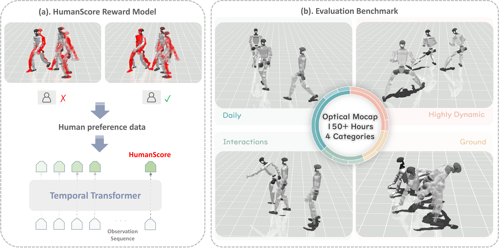

<div align="center">

# HumanTracker: Towards Comprehensive and Human-Aligned Motion Tracking Benchmark

Dairu Liu\* · Zekun Qi\* · Jiayu Zeng\* · Ruixi Yu · Yu Guan · Yintianrun Zhang · Xuchuan Chen
Sikai Liang · Zekai Li · Chenghuai Lin · Xinqiang Yu · Wenyao Zhang · He Wang† · Li Yi†

Nankai University · Tsinghua University · Galbot · Shanghai Jiao Tong University · Peking University · Shanghai Qi Zhi Institute

\*Equal contribution  †Corresponding author

**ECCV 2026**

<p align="center">
  <a href="https://dairuliu.github.io/humantracker/"></a>
  <a href="https://arxiv.org/abs/2608.13555"></a>
  <a href="https://huggingface.co/datasets/GalaxyGeneralRobotics/HumanTracker"></a>
  <a href="https://github.com/GalaxyGeneralRobotics/HumanTracker"></a>
</p>



</div>

---

Humanoid motion tracking is central to teleoperation and whole-body imitation, yet
evaluation often disagrees with what people perceive in videos. Kinematic errors
average per-frame pose differences but miss the physical artifacts that matter most —
unstable support, and incorrect contacts such as foot skating and mistimed
touch-downs. Widely used test suites are also small, and lack the diversity needed to
stress contact-rich, long-horizon behaviors.

HumanTracker makes humanoid tracking evaluation both perceptually aligned and
scalable. It contributes **approximately 153 hours of newly captured optical motion**
from 24 professional performers, organized into four motion families with text labels
for fine-grained diagnosis. On top of it we propose **HumanScore**, a preference-aligned
metric trained from **12K human-labeled preference pairs** spanning **24K synchronized
tracker trajectories** via a trajectory reward model. Across representative
state-of-the-art trackers, HumanScore better predicts held-out human preferences and
reveals contact and stability failures that kinematic metrics often miss.

This repository holds the evaluation harness, the HumanScore reward model, and the
data tools used to build the preference dataset.

## News

- **2026-09-28** — Evaluated nine additional released G1 trackers on the HumanTracker test split.
- **2026-08-22** — Evaluated SONIC 1.1.
- **2026-06-19** — Accepted to ECCV 2026.

## The benchmark

Motions are grouped into four families by the failure regime they expose. All results
are reported per family as well as in aggregate; the distribution reflects the
frequency of the captured activities rather than forcing equal family sizes.

| Family | Hours | Clips | Typical challenges |
| --- | --- | --- | --- |
| Daily | 89 | 9.7k | steady locomotion, mild contacts |
| Highly Dynamic | 11 | 2.7k | impacts, aerial phases, fast footwork |
| Interaction | 48 | 10.9k | human-like, stable, smooth hands-body coordination |
| Ground | 5 | 1.6k | low posture, multi-contact transitions |
| **Total** | **153** | **25K** | |

Each clip carries a motion-family label, a natural-language description, a fitted SMPL
sequence, and a robot-space reference trajectory in `qpos` format. Human motion is
retargeted to the benchmark humanoid with
[GMR](https://arxiv.org/abs/2510.02252); retargeted sequences are inspected and
segments with capture artifacts (unexplained floating, ground penetration,
discontinuous contacts) are removed. The dataset is split 9:1 into disjoint train and
test partitions with the family distribution preserved.

### Zero-shot results

Succ (%) ↑, MPJPE (rad) ↓, HumanScore ↑ on a 0–100 scale, and joint Jerk
(rad/s³) ↓, computed on the test split.
All rows below are full-test-split measurements from this evaluator, using
`whole_body` termination. GMT, TWIST2, SONIC, SONIC 1.1 and Humanoid-GPT were
evaluated locally on 2026-09-11–12 to report all four metrics from the same run
per method. Their earlier paper-reference values are retained separately below.

| | Daily | | | | Highly Dynamic | | | | Interaction | | | | Ground | | | |
| --- | --- | --- | --- | --- | --- | --- | --- | --- | --- | --- | --- | --- | --- | --- | --- | --- |
| **Method** | Succ | MPJPE | HScore | Jerk | Succ | MPJPE | HScore | Jerk | Succ | MPJPE | HScore | Jerk | Succ | MPJPE | HScore | Jerk |
| GMT | 17.7 | 0.250 | 2.4 | 1101.6 | 35.8 | 0.198 | 6.8 | 1067.0 | 81.2 | 0.204 | 11.8 | 530.8 | 0.0 | 0.456 | 4.0 | 448.3 |
| TWIST2 | 58.7 | 0.106 | 9.9 | 1065.9 | 39.2 | 0.115 | 16.8 | 1057.7 | 91.6 | 0.112 | 28.3 | 369.5 | 0.0 | 0.341 | 4.5 | 2050.5 |
| SONIC | 93.7 | 0.102 | 49.5 | 417.1 | 83.6 | 0.118 | 40.7 | 449.8 | 97.4 | 0.127 | 54.7 | 196.1 | 19.5 | 0.231 | 27.0 | 299.1 |
| SONIC 1.1 | 94.4 | 0.093 | 43.7 | 436.5 | 84.7 | 0.108 | 38.5 | 396.0 | 97.8 | 0.111 | 48.7 | 226.4 | 13.4 | 0.198 | 34.1 | 272.2 |
| Humanoid-GPT | 94.3 | 0.046 | 54.6 | 398.1 | 87.7 | 0.047 | 48.9 | 339.7 | 97.2 | 0.069 | 56.7 | 124.7 | 32.3 | 0.213 | 25.2 | 2202.7 |
| ScaleBFM (14-point) | 91.7 | 0.093 | 41.6 | 363.9 | 73.9 | 0.094 | 39.6 | 316.2 | 97.4 | 0.084 | 56.7 | 94.8 | 18.3 | 0.180 | 62.1 | 152.7 |
| ScaleBFM (5-point) | 90.3 | 0.142 | 23.4 | 372.1 | 70.9 | 0.141 | 34.0 | 310.1 | 97.3 | 0.131 | 47.7 | 95.7 | 17.7 | 0.216 | 56.0 | 151.3 |
| HoloMotion | 91.1 | 0.085 | 37.0 | 475.3 | 66.4 | 0.098 | 42.9 | 359.5 | 96.3 | 0.093 | 53.4 | 121.2 | 11.0 | 0.178 | 37.7 | 223.7 |

`Jerk` is `joint_jerk_mean`: the mean absolute third finite difference of
simulated joint angles, divided by the control timestep cubed. Each trajectory
is averaged over time and joints; category values are unweighted means over
valid trajectories with finite jerk, matching the evaluator's summary. This is
neither RMS jerk nor policy-target `action_jerk_mean`. Values come from the same
full-run records as each row's other metrics. All eight rows have complete jerk
records; these values are not spliced into the earlier paper-reference results.

The five new runs each contain 2500 valid trajectories with zero runtime errors
(12500 in total), using the native CPU backends, CPU HumanScore, eight workers,
and no reference noise. Motion counts are Daily 974, Highly Dynamic 268,
Interaction 1094, and Ground 164. Policy files are GMT `pretrained.pt`, TWIST2
`twist2_1017_25k.onnx`, the separate SONIC release/1.1 encoder-decoder pairs,
and Humanoid-GPT `pns_wo_priv264.onnx`. The local run records, artifact hashes
and validation report are under `outputs/eval_runs/20260911_jerk_completion/`.
ScaleBFM and HoloMotion retain their previously measured full-run results.

Every tracker keeps its native observation and action-processing stack, receives the
same retargeted references, and is measured by the same evaluator under the SONIC
termination criterion.

ScaleBFM and HoloMotion are not part of the paper's Table 2. Their rows are this
evaluator's own measurements over the full 2500-clip test split. ScaleBFM uses the
CPU-reconstructed backend described below; HoloMotion uses the official v1.4.1
`model_16200.onnx`. Both use `whole_body` termination.

The ScaleBFM 14-point row uses `--control_mode 7`; the five-point row uses
`--control_mode 4` (pelvis, both ankles and both wrists) with the same
`model_22200.pt` checkpoint. The five-point full-test evaluation ran locally
on 2026-09-10–11 using the native CPU backend, no reference noise, and
`whole_body` termination: all 2500 trajectories produced valid metrics with
zero runtime errors. Both rows report full-body metrics, not five-point-only
errors; the original 14-point results are retained, not rerun here.

#### Paper Table 2 reference

These are the original paper-reference values previously shown in the main
table, preserved without changes. They are not the new local measurements and
do not include Jerk. Units and category ordering match the main table.

| | Daily | | | Highly Dynamic | | | Interaction | | | Ground | | |
| --- | --- | --- | --- | --- | --- | --- | --- | --- | --- | --- | --- | --- |
| Method | Succ | MPJPE | HScore | Succ | MPJPE | HScore | Succ | MPJPE | HScore | Succ | MPJPE | HScore |
| GMT | 17.0 | 0.250 | 2.4 | 36.2 | 0.196 | 7.0 | 81.4 | 0.205 | 11.7 | 0.0 | 0.456 | 4.0 |
| TWIST2 | 60.1 | 0.105 | 10.1 | 39.9 | 0.112 | 16.9 | 91.3 | 0.111 | 28.3 | 0.0 | 0.341 | 4.5 |
| SONIC | 93.8 | 0.102 | 49.5 | 82.1 | 0.118 | 41.0 | 97.6 | 0.128 | 54.6 | 20.1 | 0.231 | 26.5 |
| Humanoid-GPT | 94.4 | 0.046 | 54.7 | 86.9 | 0.047 | 49.2 | 97.2 | 0.070 | 56.8 | 32.9 | 0.216 | 24.9 |

## Installation

Prerequisites: Conda or Miniconda. CPU evaluation is supported, including macOS
Apple Silicon. GPU execution additionally requires compatible NVIDIA CUDA
libraries; the CPU checks do not validate CUDA training or evaluation.

```bash
conda create -n humantracker python=3.12 -y
conda activate humantracker
pip install -e .
```

Optional extras:

```bash
pip install -e ".[annotation]"   # web annotation interface and video export
```

Copy `.env.example` to `.env` for experiment-tracking credentials. `.env` is
gitignored and must never be committed.

### Self-contained tracker runtimes

All seven backends run from this repository in the same environment. No external
code checkout, Git submodule, symlink, `sys.path` injection, or tracker-specific
Conda environment is required. Standard Python libraries are installed by
`pip install -e .`; policy weights and motion datasets remain separate artifacts.

Download public policies directly, without cloning their source repositories
(the local HGPT sparse checkpoint described below is not in the downloader):

```bash
python -m humantracker.download_weights --tracker all
# Or download just one backend:
python -m humantracker.download_weights --tracker holomotion
```

The downloader checks SHA-256 for every artifact, verifies existing files, and
refuses to overwrite a mismatched file. The historical `setup_thirdparty.sh`
command now forwards to this downloader; it does not clone, checkout or patch
anything. Existing external checkouts are neither used nor modified.

| Backend | Default standalone artifacts under `storage/checkpoints/trackers/` |
| --- | --- |
| SONIC 1.1 (`sonic`) | `sonic_v1_1/model_encoder.onnx`, `model_decoder.onnx` |
| Humanoid-GPT (`hgpt`) | `hgpt/pns_wo_priv264.onnx` |
| Humanoid-GPT five-point (`hgpt_sparse`) | `hgpt_sparse/sparse5pt_best_stage2_4B_cumulative9B.onnx` (provide separately) |
| TWIST2 (`twist2`) | `twist2/twist2_1017_25k.onnx` |
| GMT (`gmt`) | `gmt/pretrained.pt` |
| ScaleBFM (`scalebfm`) | `scalebfm/model_22200.pt`, metadata JSON, mode table |
| HoloMotion (`holomotion`) | `holomotion/model_16200.onnx` (v1.4.1) |

SONIC and SONIC 1.1 share one backend, selected by the encoder input layout.
To use the original SONIC policy, download `--tracker sonic_release` and pass
`--encoder storage/checkpoints/trackers/sonic/model_encoder.onnx` and the
corresponding `--decoder`. `--tracker hgpt216` downloads the optional older
HGPT weight; select it with the evaluator's `--policy` flag. The downloader's
`--output_dir` can select another artifact directory; evaluator path overrides
must then point there.

ScaleBFM reconstructs the raw RSL-RL actor in plain PyTorch and requires
`--device cpu`; it does not use ScaleBridge or a TensorRT engine. The metadata
and mode table are distributed alongside the upstream TensorRT build, but are
configuration rather than a compiled graph. `--control_mode 7` (default) tracks
all 14 bodies; mode 4 is the five-point configuration. Other compatible weights
can be selected with `--policy`, `--metadata` and `--mode_table`.

HoloMotion preserves the official v1.4.1 604-D Warp observation kernel,
50 Hz policy / 200 Hz physics contract, and the joint order, PD gains, default
pose and action scale embedded in ONNX metadata. Its exact artifact SHA-256 is
`2aabb53bd86b1860dd07b24d02710f4b988f9c201655becb45a2378604599ad7`.
The benchmark's G1 scene is the 29-DoF `mode_machine=15` configuration.
HoloMotion weights retain their CC BY-NC-SA 4.0 license.

### Humanoid-GPT five-point sparse tracker

Select `--tracker hgpt_sparse` to use the native five-point observation builder.
In order, the reference points are `pelvis`, `left_ankle_roll_link`,
`right_ankle_roll_link`, `left_wrist_yaw_link`, and `right_wrist_yaw_link`.
The 182-D float32 observation contains 93 proprioceptive values, 75 sparse
reference values (all positions, then all 6D rotations, then all spatial
velocities), and 14 root-command values. Spatial velocities are angular then
linear, expressed in the gravity-view frame. This is not position-only tracking.
Reference joint angles and the other nine reference keypoints do not enter the
policy; complete motion references are still required to compute full-body
tracking metrics and HumanScore.

Provide the local checkpoint separately at the table's default path, or use
`--policy /path/to/policy.onnx`. The verified checkpoint is
`sparse5pt_best_stage2_4B_cumulative9B.onnx` (12,052,251 bytes), SHA-256
`cbbd84d71a9ff671017e9dfce2a9ef99f95a5b5d31348cef87eafd33715d346f`.
It is not committed or downloaded by `--tracker all`; no public download URL
is assumed. Compatible replacements must expose `obs` with shape `[batch, 182]`
and `continuous_actions` with shape `[batch, 29]`. Dense, three-point, recurrent
and privileged policies are not supported by this backend.

```bash
python -m humantracker.eval.eval_parallel_tracker \
    --tracker hgpt_sparse --device cpu --rm_device cpu \
    --mocap_path storage/dataset/HumanTracker/motions \
    --test_json storage/dataset/HumanTracker/motions/test.json \
    --termination_metric whole_body --workers 1 --video_interval 0 \
    --output_json outputs/eval_runs/hgpt_sparse.json
```

Like `hgpt`, precomputed keypoint references are used by default; pass
`--convert --no_cache` to derive them from motion qpos. Timing, action scaling
and PD control match the upstream sparse parallel evaluator; no implicit EMA
is added. The existing benchmark result table does not include sparse results
until a full benchmark has been run.

The HGPT runtime contains only the evaluation-specific MuJoCo/ONNX path, not
its upstream training/MJX stack. Source revisions, modifications and license
notices are recorded in
[native/SOURCES.md](src/humantracker/eval/native/SOURCES.md).
**ScaleBFM's extracted network has unresolved redistribution licensing; review
that notice before publishing this local integration.** Its code is not
relicensed as Apache-2.0.

## Evaluating a tracker

Every tracker is converted to the same 29-DoF humanoid `qpos` representation and run
through one common MuJoCo evaluation entry point. Each backend keeps its native policy
observations and action decoder; the evaluator standardizes the motion list, robot
model, reference indexing, rollout accounting and metric implementation, and records
the same state history — generalized position/velocity, action, motor target, foot
contacts and forces, foot/pelvis velocities and 14 keypoint poses — for every tracker,
so differences in post-processing are never mistaken for differences between trackers.

```bash
python -m humantracker.eval.eval_parallel_tracker \
    --tracker sonic \
    --mocap_path /path/to/HumanTracker \
    --test_json /path/to/HumanTracker/test.json \
    --termination_metric whole_body
```

HumanScore is read from `storage/checkpoints/reward_model/best.pt`, where the released
weights unpack; `--rm_checkpoint` selects another one.

`--tracker` accepts `sonic`, `twist2`, `gmt`, `hgpt`, `hgpt_sparse`, `scalebfm` and `holomotion`,
one backend module each under [backends/](src/humantracker/eval/backends). A backend
declares the flags only it needs — `--policy` for `twist2`, `gmt`, `hgpt`, `hgpt_sparse`,
`scalebfm` and `holomotion`,
`--encoder`/`--decoder` for `sonic`, `--metadata`/`--mode_table`/`--control_mode` for
`scalebfm` — so `--help` shows the selected tracker's options and no others.
`scalebfm` additionally requires `--device cpu`: unlike the GPU
backends, it never runs on CUDA (see the table above).
`--termination_metric whole_body` applies SONIC's published termination terms
uniformly to every tracker, which is what the paper reports; `trunk` uses the same
thresholds but watches the pelvis and torso only. The flag is required — there is
no default, so a results file always states which rule produced it.

Within one tracker, `--workers` (default 8) evaluates trajectories in parallel worker
processes on a single GPU. To evaluate multiple trackers at once, run one process per
GPU with `CUDA_VISIBLE_DEVICES`:

```bash
CUDA_VISIBLE_DEVICES=0 python -m humantracker.eval.eval_parallel_tracker --tracker sonic  ... &
CUDA_VISIBLE_DEVICES=1 python -m humantracker.eval.eval_parallel_tracker --tracker twist2 ... &
CUDA_VISIBLE_DEVICES=2 python -m humantracker.eval.eval_parallel_tracker --tracker gmt    ... &
```

[`eval.sh`](src/humantracker/eval/eval.sh) automates the five GPU backends, including
HoloMotion, on GPUs 0–4. ScaleBFM remains a separate CPU run:

```bash
export HUMANTRACKER_DATASET=/path/to/HumanTracker
bash src/humantracker/eval/eval.sh
```

### Metrics

Reported per motion family and in aggregate, on the test split only:

- **Succ** — fraction of episodes that run to completion. An episode fails once the
  vertical position error at the pelvis, either ankle or either wrist exceeds 0.25 m,
  the pelvis rotation error exceeds 1 rad, or `qpos`/`qvel` goes non-finite.
- **MPJPE** — mean absolute error over the 29 actuated joint angles (radians), over the
  executed portion of the rollout.
- **HumanScore** — the preference-aligned score below, on a 0–100 scale.

Additional diagnostics (joint-velocity error, keypoint-position error, foot-contact
agreement, joint acceleration/jerk) are computed from the same recorded state and used
in the paper's preference-alignment study rather than the headline table.

### HumanScore at evaluation time

A rollout of `F` frames is split into consecutive 250-frame (5 s at 50 Hz) windows,
with a shorter final window padded on the right and scored through the same validity
mask used in training. Each window's unbounded reward is mapped through a sigmoid to
`(0, 1)`, and HumanScore is 100× the frame-count-weighted mean of the window scores —
padding contributes no weight. This windowed, mask-aware scoring is implemented once in
[`rm_scorer.py`](src/humantracker/eval/core/rm_scorer.py) and shared by every backend.

### Reproducibility

`--device cpu` is bit-reproducible: two runs of the same command return identical metrics.
`--device cuda` is not. Repeating one single-trajectory run gave three distinct outcomes in
four runs — the kinematic metrics moved in the third significant figure (`joint_pos_mae`
0.0786 to 0.0803), and HumanScore, which reads the whole sequence at once, moved from -0.35
to -0.53. The closed loop runs on the order of 1600 control steps, so a last-bit difference
in one policy forward pass has room to grow, and no seed or determinism flag is set anywhere
in the eval. Report GPU results as means over the full test set, as the paper does, and use
`--device cpu` when you need a figure to land on the same bits twice.

## Training HumanScore

HumanScore is a Transformer reward model trained on pairwise human preferences over
synchronized tracker rollouts.

**Input.** Each frame is a 539-dimensional token: 70 dimensions describing the current
reference (root pose/velocity, joint position/velocity, foot contact) and 469
dimensions describing the simulated rollout (robot state and action, measured contact
dynamics, root motion and current keypoint kinematics). The reported model does not
use future-reference residuals — conditioning only on the current reference and
rollout history is enough to assess tracking quality, and is what
[`trainer.py`](src/humantracker/reward_model/train/trainer.py) trains by default. The
full per-block breakdown is in the paper's appendix.

**Architecture.** The 539-d token is linearly projected, normalized, and given
sinusoidal positional encoding, then passed through a Transformer encoder with a
padding mask applied at every attention layer. Segments shorter than 250 frames (5 s at
50 Hz) are right-zero-padded; the same validity mask excludes padding from both
attention and the masked-mean pooling that forms the trajectory representation, so full
and truncated windows share one model without padding artifacts. An MLP head maps the
pooled representation to a scalar, unbounded reward
([`reward_model.py`](src/humantracker/reward_model/models/reward_model.py)).

**Objective.** For a strict preference pair, the model scores the chosen and rejected
trajectory and trains their score gap with a Bradley–Terry loss. Rarer `Similar` pairs
(annotators found neither trajectory clearly better) instead get a symmetric loss that
targets a 0.5 win probability. Both are implemented as one soft-target Bradley–Terry
objective in
[`SoftTargetBradleyTerryLoss`](src/humantracker/reward_model/models/loss.py).

**Data.** `preference_pair/` in the dataset release is the training input. Every row
carries one human label together with the two tracker rollouts it compares, so nothing
has to be re-simulated:

```bash
hf download GalaxyGeneralRobotics/HumanTracker --repo-type dataset \
    --include 'preference_pair/*' --local-dir storage/dataset/HumanTracker

python -m humantracker.reward_model.train.trainer \
    --data_dir storage/dataset/HumanTracker/preference_pair \
    --cache_dir storage/dataset/reward_model/cache \
    --output_dir storage/checkpoints/reward_model
```

The download is 10 GB. The first run decodes the rollouts into `--cache_dir` as `float32`
memmaps, another 13 GB, and prints the split it produced — 8,296 train, 922 validation,
2,296 test samples, counting the bilateral-flip copy of each pair. Subsequent runs
revalidate that cache instead of rebuilding it.

`preference_pair/` is `<split>/<split>-NNNNN-of-NNNNN.parquet` beside `train.json` and
`test.json`. One row is one comparison:

| Column | Meaning |
| --- | --- |
| `record_id`, `pair_id` | pair identity |
| `motion_id`, `category` | source motion and its family |
| `tracker_pair_key`, `candidate_0_tracker`, `candidate_1_tracker` | which trackers, and in which candidate slot |
| `choice_type` | `preference`, `similar`, or `bad_traj` |
| `preferred_candidate_idx` | `0` or `1` for `preference`, else null |
| `source_start_frame`, `source_end_frame`, `num_frames`, `fps` | labeled window |
| `candidate_0_npz`, `candidate_1_npz` | the two tracker rollouts, one NPZ per candidate |
| `motion_npz` | retargeted source clip for the window |
| `annotation_json` | the full record the columns above summarize |

The two candidate NPZs hold the frame-aligned arrays the 539-d token is cut from, named
after the blocks in [`features.py`](src/humantracker/reward_model/features.py).
`bad_traj` pairs are dropped, which is why 6,000 labels become 5,757 trained pairs.
`train.json` names the validation records outright rather than resampling them, so epoch
selection matches the released checkpoint.

Each run writes `<output_dir>/<run_name>/{best,last}.pt`; promote the run you want to
serve to `storage/checkpoints/reward_model/best.pt`, the path
[`eval.sh`](src/humantracker/eval/eval.sh) and the eval entry point read by default.
[`train.sh`](src/humantracker/reward_model/train/train.sh) in the same directory wraps
the command above with the paper's reported hyperparameters (`d_model=256`, 4 layers,
8 heads, batch size 8, AdamW at `1e-4` with cosine warmup, 20 epochs, `float32`) and
reads `DATA_DIR` from the environment. Evaluate a trained checkpoint against the
held-out, motion-disjoint test cohort with
[`evaluate_checkpoint.py`](src/humantracker/reward_model/train/evaluate_checkpoint.py):

```bash
python -m humantracker.reward_model.train.evaluate_checkpoint \
    --checkpoint storage/checkpoints/reward_model/best.pt \
    --cache_dir storage/dataset/reward_model/cache \
    --output preference_accuracy.json
```

## Building preference data

The preference pool is generated exclusively from the training split: for each source
motion, GMT, TWIST2, SONIC and Humanoid-GPT produce aligned rollouts of the same
robot-space reference, each divided into consecutive 5 s (250-frame) windows. A
uniformly spaced sample across the full ordered catalogue selects 6,000 windows, with
the six unordered tracker pairs allocated equally so every tracker appears equally
often and no pairing dominates. Six doctoral researchers in humanoid robotics compared
each pair for balance, contact, stability and naturalness, choosing a strict
preference, `Similar`, or `Cannot compare` (excluded from training). Records are split
80/20 by source `motion_id`, so all clips from one motion stay in one partition.

`tool/` holds the two utilities the released pipeline depends on:

| Directory | Responsibility | Entry point |
| --- | --- | --- |
| [rm_pipeline/](tool/rm_pipeline) | Rollout clipping, preference-pair construction, validation, aggregation, reward-model export | `python -m tool.rm_pipeline --help` |
| [motion_annotation/](tool/motion_annotation) | Pairwise motion rendering and the human annotation interface | `bash tool/motion_annotation/run_prerender_all.sh` |

The layout the released pairs use — one label beside the two rollouts it compares — is
documented in [data_formats.md](tool/rm_pipeline/data_formats.md). Runtime readers accept
only the canonical schema. Records that do not match fail validation; nothing is silently
coerced or padded.

## Repository layout

```
src/humantracker/
  eval/              tracker evaluation harness
    backends/        per-tracker simulation loops (internal modules)
    core/            shared metrics, HumanScore features, rollout export
    native/          bundled HGPT, HoloMotion and ScaleBFM runtime components
  reward_model/      HumanScore model, datasets and training
  data/              motion-disjoint train/test splitting
tool/
  rm_pipeline/       preference-pair construction
  motion_annotation/ rendering and human annotation
thirdparty/patches/  historical upstream patches (not used at runtime)
storage/             datasets, checkpoints and generated artifacts (not tracked)
```

## Configuration

Paths are resolved relative to the repository root, and every machine-specific value
comes from a flag or an environment variable. Scripts fail immediately with a message
naming the variable rather than guessing a default.

| Variable | Used by | Meaning |
| --- | --- | --- |
| `HUMANTRACKER_DATASET` | `eval.sh` | motion dataset root |
| `HUMANTRACKER_RM_CHECKPOINT` | `eval.sh` | HumanScore checkpoint (default: `storage/checkpoints/reward_model/best.pt`) |
| `G1_VERSION` | `hgpt` and `hgpt_sparse` backends | defaults to `5010`; other revisions are rejected |
| `HUMANTRACKER_ROLLOUT_RUN_ID` | rollout export | run id used in exported filenames (or `--rollout_run_id`) |
| `DATA_DIR` | `train.sh` | `preference_pair/` directory of the dataset release |
| `TASK_FILE` | `run_prerender_all.sh` | `pairs.jsonl` produced by `rm_pipeline` |
| `HF_LOGS_DIR` | `run_prerender_all.sh` | directory annotations are written to |
| `PYTHON` | all shell scripts | interpreter to use (defaults to `python`) |

Evaluation renders headlessly: `MUJOCO_GL`, `PYOPENGL_PLATFORM` and
`__EGL_VENDOR_LIBRARY_DIRS` are set to EGL and to the ICD file in
[egl_conf/](egl_conf) before MuJoCo is imported. Exporting any of them beforehand takes
precedence, which is how a machine with a different driver is accommodated.

## Citation

```bibtex
@misc{liu2026humantrackercomprehensivehumanalignedmotion,
      title={HumanTracker: Towards Comprehensive and Human-Aligned Motion Tracking Benchmark}, 
      author={Dairu Liu and Zekun Qi and Jiayu Zeng and Ruixi Yu and Yu Guan and Yintianrun Zhang and Xuchuan Chen and Sikai Liang and Zekai Li and Chenghuai Lin and Xinqiang Yu and Wenyao Zhang and He Wang and Li Yi},
      year={2026},
      eprint={2608.13555},
      archivePrefix={arXiv},
      primaryClass={cs.RO},
      url={https://arxiv.org/abs/2608.13555}, 
}
```

## License

HumanTracker-authored code is released under the [Apache License 2.0](LICENSE).
Bundled runtime components and policy weights retain their upstream notices and
license status; see [SOURCES.md](src/humantracker/eval/native/SOURCES.md),
including the unresolved ScaleBFM redistribution notice. The G1
description in [storage/assets/unitree_g1_5010/](storage/assets/unitree_g1_5010) is
redistributed under Unitree Robotics' BSD 3-Clause license, included alongside it.

## Acknowledgements

We build on [GMR](https://arxiv.org/abs/2510.02252) for retargeting, and evaluate
[GMT](https://github.com/zixuan417/humanoid-general-motion-tracking),
[TWIST2](https://github.com/amazon-far/TWIST2),
[SONIC](https://arxiv.org/abs/2511.07820) and
[Humanoid-GPT](https://github.com/GalaxyGeneralRobotics/Humanoid-GPT). We thank the
performers and annotators whose work makes this benchmark possible.
